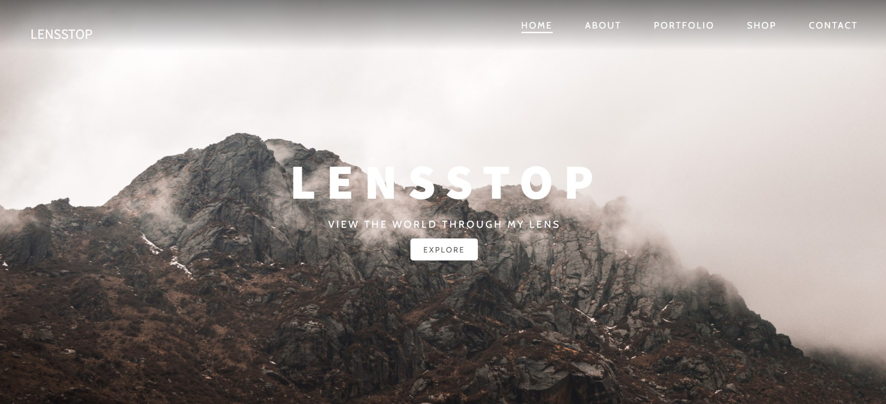
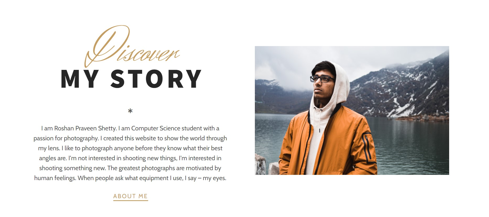
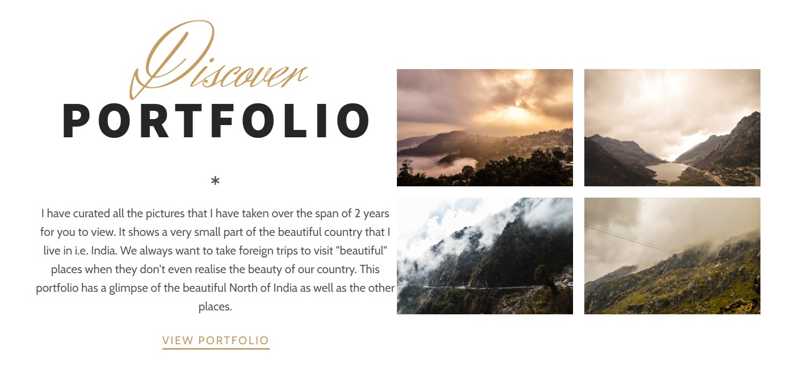
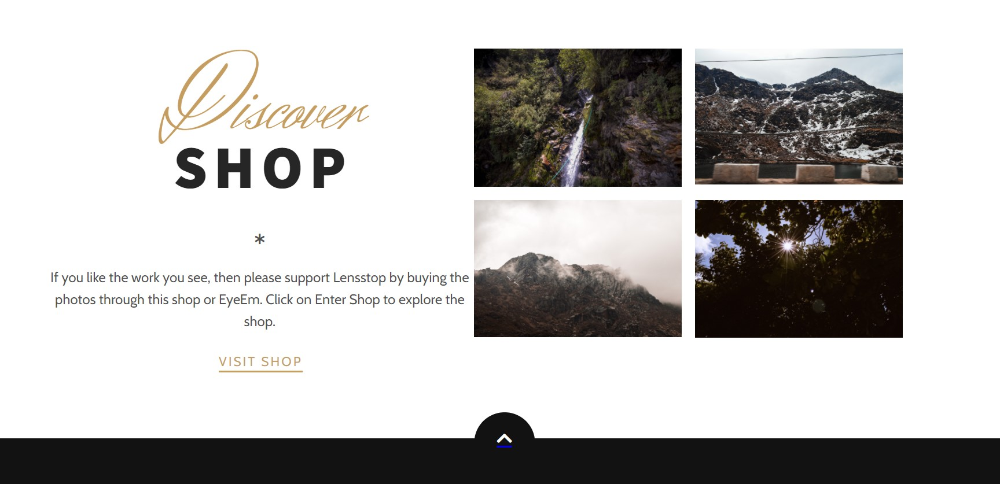
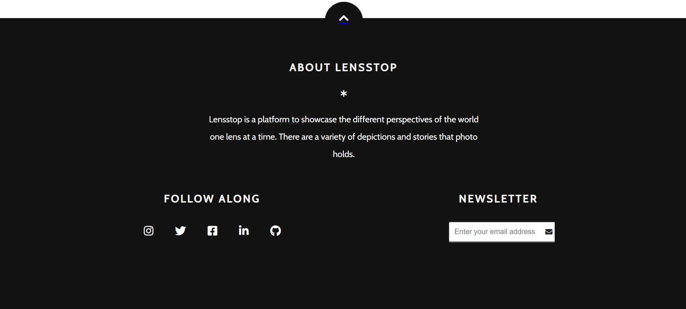

# Lensstop

Lensstop is a photography website built using HTML, CSS, and Javascript that showcases my photos. You can visit it at https://roshanpshetty.github.io/Lensstop/

# Pages

* **Home** - The Home page contains all the 5 sections with that give a gist of each page. 

* **About** - The About page contains information regarding the photographer.

* **Portfolio** - The Portfolio page contains all the photos that the photographer presents in a responsive order. 

* **Shop** - The Shop page contains images that could be bought using the link to EyeEm or from that page itself.

* **Contact** - The Contact section allows anyone to check out any of social link and subscribe for the montly newsletter. 

# Website

You can visit the website at https://roshanpshetty.github.io/Lensstop/
